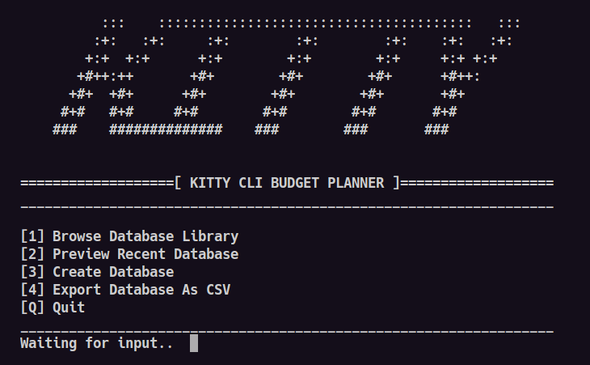

# 🐈 Kitty CLI Planner
**100% Python** based terminal budget planner, made with sweat & spaghettis.



>[!IMPORTANT]
>Project for 26 SBA.\
>This will no longer be maintained.

## Installing

### Update pip
```bash>
python -m pip install --upgrade pip
```
### Clone repository
>Windows
```
cd ˜/
git clone https://github.com/norwaa/Kitty-Planner-CLI.git
cd Kitty-Planner-CLI/goober/
```

>Linux
```
cd ~/.local/share
git clone https://github.com/norwaa/Kitty-Planner-CLI.git && cd Kitty-Planner-CLI/goober/

```
## Dependencies
```bash
pip install tabulate pandas pyfiglet
```

## Executing
```bash
python main.py
```